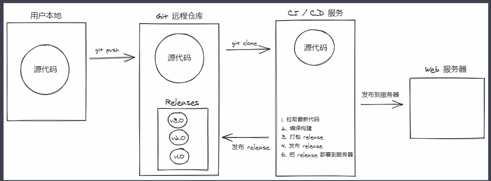

## 新作业

#### 解答题：

**1.说说 application/json 和 application/x-www-form-urlencoded 二者之间的区别。**

- application/x-www-form-urlencoded好处就是浏览器都支持，在请求发送过程中会对数据进行序列化处理，以键值对形式，例如:key1=value1&key2=value2的方式发送到服务器。

- application/json好处就是前端人员不需要关心数据结构的复杂度，只要是标准的json格式就能提交成功；将application/json作为请求content-type，告诉服务器请求的主体内容是json格式的字符串，服务器端会对json字符串进行解析。

**2.说一说在前端这块，角色管理你是如何设计的。**

>角色管理是权限管理的分支。角色代表着不同权限的集合。

1. 根据具体业务需求，每个角色都分配明确的权限。
2. 然后把这些角色分配给不同的用户，这些用户就拥有了不同的权限。

**３.@vue/cli 跟 vue-cli 相比，@vue/cli 的优势在哪？**

1. @vue/cli提供了GUI维护界面。方便了不喜欢终端里输入命令的开发者，创建配置项目，安装依赖、插件等。
2. vue-cli 3+的项目摒弃了 config 、 build 、 static 目录，新增了 public 目录，将根目录下的 index.html 放置在 public 目录下。浏览器
3. 新增vue.config.js (需手动建立)配置文件，能够在该文件中进行webpack的相关配置，例如 loader、开发环境等。babel
4. 新增.browserslistrc 文件，指定项目的目标浏览器的范围，用来肯定须要转译的 JavaScript 特性和须要添加的 CSS 浏览器前缀，能够理解为浏览器兼容。
5. 新增 babel.config.js 替代原先的.babelrc，具有和原先.babelrc同样的做用。
6. src文件夹中多了 views 文件夹
7. 修改配置：vue-cli 3+的设计原则是“零配置”，移除（隐藏）配置文件 build 和 config 等目录
　

**４.详细讲一讲生产环境下前端项目的自动化部署的流程。**



1. 在用户本地写完代码后上传到远程仓库。
2. 远程仓库获取到用户的更新推送后通知CI/CD服务。
    - 拉取最新代码
    - 编译构建
    - 打包release（发布包）
    - 发布release
    - 把release部署到服务器
3. 发布到web服务器

自动化部署脚本:
```
name: Publish And Deploy Demo
on:
  push:
    tags:
      - "v*"

jobs:
  build-and-deploy:
    runs-on: ubuntu-latest
    steps:
      # 下载源码
      - name: Checkout
        uses: actions/checkout@master

      # 打包构建
      - name: Build
        uses: actions/setup-node@master
      - run: npm install
      - run: npm run build
      - run: tar -zcvf release.tgz .nuxt static nuxt.config.js package.json package-lock.json pm2.config.json

      # 发布 Release
      - name: Create Release
        id: create_release
        uses: actions/create-release@master
        env:
          GITHUB_TOKEN: ${{ secrets.TOKEN }}
        with:
          tag_name: ${{ github.ref }}
          release_name: Release ${{ github.ref }}
          draft: false
          prerelease: false

      # 上传构建结果到 Release
      - name: Upload Release Asset
        id: upload-release-asset
        uses: actions/upload-release-asset@master
        env:
          GITHUB_TOKEN: ${{ secrets.TOKEN }}
        with:
          upload_url: ${{ steps.create_release.outputs.upload_url }}
          asset_path: ./release.tgz
          asset_name: release.tgz
          asset_content_type: application/x-tgz

      # 部署到服务器
      - name: Deploy
        uses: appleboy/ssh-action@master
        with:
          host: ${{ secrets.HOST }}
          username: ${{ secrets.USERNAME }}
          password: ${{ secrets.PASSWORD }}
          port: ${{ secrets.PORT }}
          script: |
            cd /root/realworld-nuxtjs
            wget https://github.com/crazyfdf/realworld-nuxtjs/releases/latest/download/release.tgz -O release.tgz
            tar zxvf release.tgz
            npm install --production
            pm2 reload pm2.config.json
```


　

**５.你在开发过程中，遇到过哪些问题，又是怎样解决的？请讲出两点。**
>前段时间，接到一个较大的外包项目，甲方提供接口。我们团队做UI设计，app前端的开发。犹豫要兼容ios和android，我们选择较熟悉的uni-app框架开发。
- 遇到问题：
  1. 设计阶段，设计前未做统一的规范设计。导致偏距，样式，字体的颜色，字重，型号等有些许不统一。前端开发完成后需要花些时间返工。
  2. 开发阶段，开发前没有一套好的业务组件库来提高开发效率。导致项目延期。
- 解决方案：
  1. 针对设计规范问题。我写了一篇产品规范文档（视觉规范、研发规范），设计、开发人员需认真阅读规范文档。根据规范设计开发。
  [产品规范文档](https://www.kancloud.cn/huo_ling/standard/2177546)
  2. 针对开发效率问题。我写了一套基于uView UI框架的UCT UI业务组件框架。提供基本的工具、组件、模板，来帮助开发者快速开发自己的项目。
  [UCT UI](https://uct-1257264070.cos-website.ap-guangzhou.myqcloud.com/components/)
　

**６.针对新技术，你是如何过渡到项目中？**

1. 新技术过渡前的评估：
  - 生态方面：新技术是否已经拥有了完善的生态环境，能否根据文档较容易的做出demo？出现问题能否快速找到解决方法？
  - 学习成本：根据团队的现有资源，学习一门新技术是否能做到快速上手？开发项目的研发周期是否在预期之内？当前业务是否真的需要使用新技术？
  - 生命周期：一个优秀的架构师要考虑未来至少2-3年不需要重构项目，新技术的生命周期是否达到标准？

2. 新技术的过渡期：
  - 新项目：新项目可以直接从零开始，逐步完善整个项目。在开发过程中同样也是对新技术的熟练和巩固过程。
  - 老项目：针对老项目，时间充裕，采用重构整个项目，时间不足，可以通过官方提供方法逐步过渡。

　


## 原作业

1.完成视频中老师提出的作业要求

2.100% 还原视频中所讲到的内容

3.完成剩下的几个模块

4.没有权限的模块，暂时不做啊，比如删除（删除东西容易导致服务器崩了）


**作业接口文档地址**

http://113.31.104.154:8081/doc.html#/home

http://113.31.104.154:8010/doc.html#/home

如果ip访问出现问题 请访问下面的

```
http://edufront.lagou.com/front/doc.html#/home
```

```
http://eduboss.lagou.com/boss/doc.html#/home
```

　

**原型图 地址**

eduboss.lagou.com

用户账号 密码

[http://eduboss.lagou.com](http://eduboss.lagou.com/)

用户名：15510792995     密码：111111
用户名：18201288771     密码：111111

　

**硬性要求**

大家不要在3-6的系统中删除数据，可以自己新增，修改或是删除自己新增的数据，否则服务器总是出问题哈

学员自己的资源 name有固定前缀 比如: 共用前缀test + 自己前缀+业务名称diy， 比如： test_lnw_menu1

作业要求:凡是里面没有权限的模块，都可以不用做哈